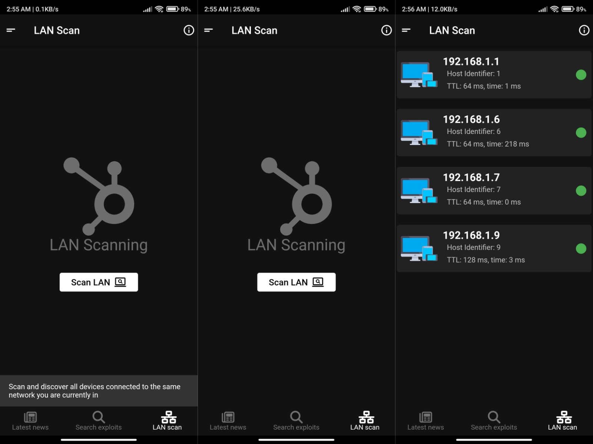
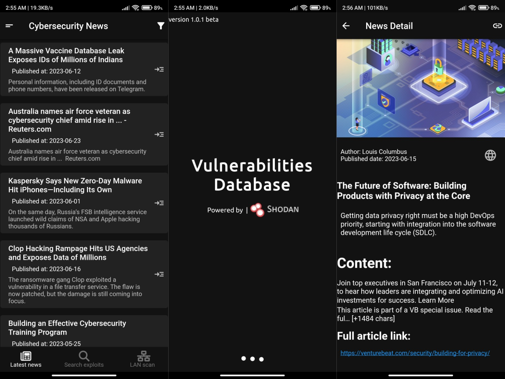
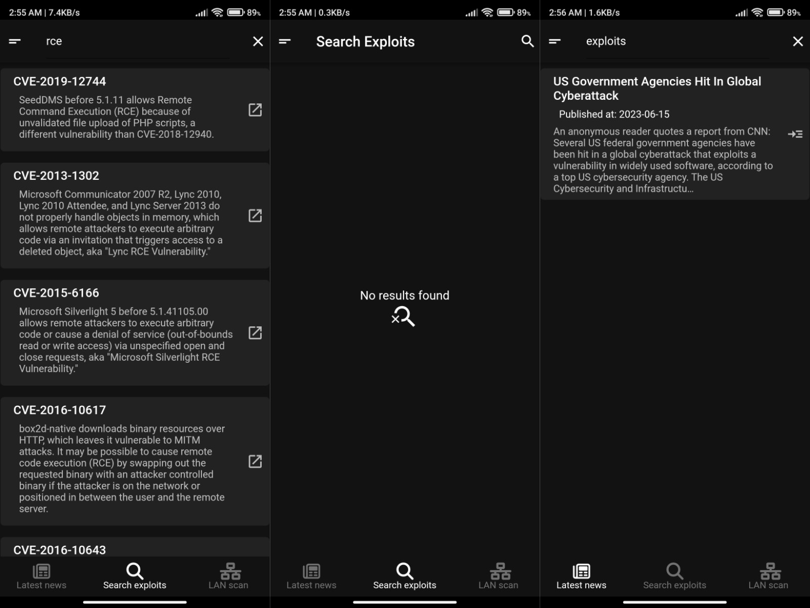

# Vulnerabilities Database App
This is a Flutter project that implements a Vulnerability Database app. It allows users to browse and search for cybersecurity news articles and exploits. The app fetches news articles from the NewsAPI and exploits data from the Shodan Exploits API.

## Getting Started
- To run this project, follow these steps:
  1. Make sure you have Flutter installed on your machine. If not, you can install Flutter from the **official Flutter website**.
  2. Clone this repository to your local machine.
  3. Open the project in your preferred Flutter IDE.
  4. Run the main.dart file to launch the app.

## Features
- Display cybersecurity news articles
- Filter news articles by searching for keywords
- Check internet connectivity and handle offline mode
- View detailed information about a news article
- Search for exploits and display search result
- Support to copy any article link in the clipboard
- Support opening full articles in mobile web browser via icon
- **(new)** Now you can scan your local network

## Screenshots




## Activities
### News Page
The `NewsPage` widget displays a list of cybersecurity news articles fetched from the NewsAPI. It supports offline functionality and dynamically updates the list of articles based on the user's search query. Articles can be filtered by title and description.

### News Detail Page
The `NewsDetailPage` widget displays detailed information about a specific news article. It includes the article's title, author, published date, description, content, and a link to the full article. Users can also copy the article link to the clipboard.

### Search Activity
The `SearchActivity` widget allows users to search for exploits using the `Shodan Exploits API`. It provides a search bar where users can enter their search term and displays a list of matching exploits. Exploits can be selected to view more details.

### Splash Activity
The `SplashActivity` widget is a splash screen that appears when the app is launched. It displays a loading animation and transitions to the main activity after a certain duration.

## Dependencies
- This project relies on the following dependencies:
  1. `flutter/material.dart`: The core Flutter framework.
  2. `flutter/services.dart`: Flutter services for system operations.
  3. `flutter/widgets.dart`: Basic Flutter widgets.
  4. `flutter/cupertino.dart`: Widgets for iOS-specific design.
  5. `flutter/cupertino.dart`: Cupertino-style widgets.
  6. `getwidget/getwidget.dart`: Flutter UI library for beautiful widgets.
  7. `intl/intl.dart`: Internationalization and localization support.
  8. `connectivity_plus/connectivity_plus.dart`: Flutter plugin for network connectivity.
  9. `dio/dio.dart`: A powerful HTTP client for Dart.
  10. `url_launcher/url_launcher.dart`: Flutter plugin for launching URLs.
  11. `flutter/foundation.dart`: Flutter foundation library.
  12. `flutter/widgets.dart`: Flutter widgets.
  13. `flutter/services.dart`: Flutter services.
- Make sure to add these dependencies to your `pubspec.yaml` file before running the project.

## Notes
- Replace your `news api key` with yours in code below in the `news_activity.dart` file:
  ```dart
  final response = await dio.get(
  'https://newsapi.org/v2/everything?q=cybersecurity&apiKey={Put your news api key here}',
  );
  ```
- Replace your `shodan api key` with yours in code below in the `search_activity.dart` file:
```dart
var response = await Dio().get('https://exploits.shodan.io/api/search?query=$searchTerm&key={Put your shodan api key here}');
      setState(() {
        exploits = response.data['matches'] as List<dynamic>;
        isSearchingInProgress = false;
        searchWord = searchTerm;
      });
```

## Author
This project was developed by Saher Muhamed @ 23/6/2023.

## Updates v1.0.0
- Adding a new feature **LAN scanning**, you can now scan your current network that you are connected to and display all connected devices.
- update date **26/6/2023**